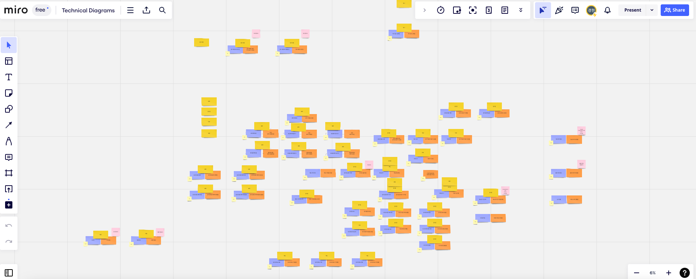
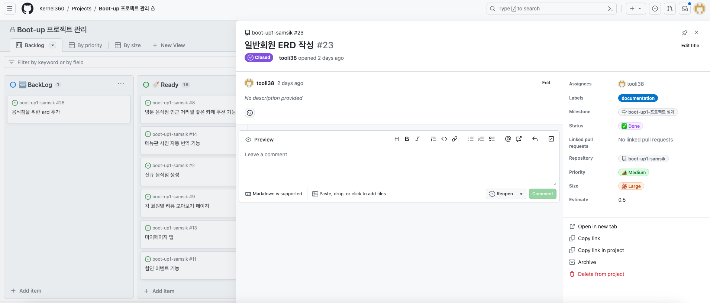
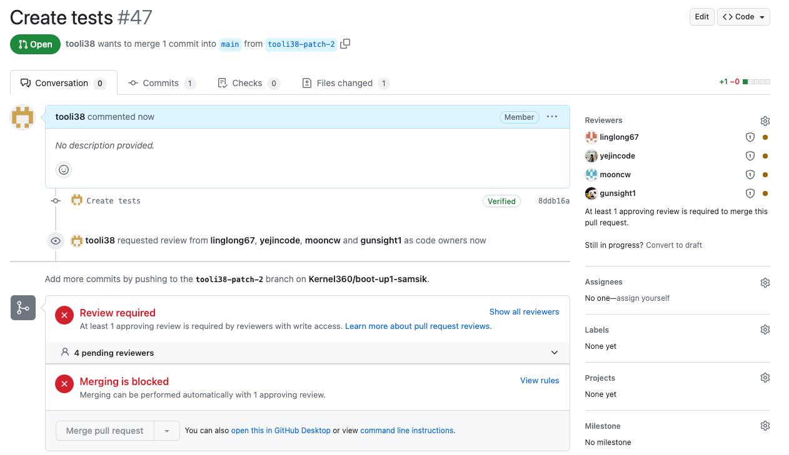

# 음식점 리뷰공유 사이트

## 프로젝트 목표

해외에 나가서도 내가 원하는 음식점을 찾아보자.

## 프로젝트 기능
- [x] 각 나라의 환율에 맞게 가격을 보여줄 수 있다.
- [x] 각 나라의 언어에 맞게 표시된 언어를 변경할 수 있다.
- [x] 사용자는 가게 목록을 조회할 수 있다.
- [x] 사용자는 특정 조건에 맞는 가게를 조회할 수 있다.
- [x] 사용자는 마음에 드는 가게를 기록할 수 있다.
- [x] 사용자는 특정 가게에 리뷰를 남기거나 수정, 삭제할 수 있다.
- [x] 사용자는 특정 가게의 모든 리뷰를 볼 수 있다.
- [x] 사용자는 특정 가게의 메뉴를 볼 수 있다.
- [x] 사용자는 특정 가게의 음식 리뷰를 남기거나 수정/삭제할 수 있다.
- [x] 사용자는 특정 가게의 메뉴를 예약을 조회하거나 생성, 삭제할 수 있다.
- [x] 가게 주인은 가게를 등록할 수 있다.
- [x] 가게 주인은 메뉴를 등록할 수 있다.
- [x] 가게 주인은 자신의 가게의 예약을 볼 수 있고, 삭제할 수 있다.

## 유즈케이스

## ERD

## API 문서

### 회원 API

### 가게 API

### 리뷰 API

### 메뉴 API

### 태그 API

# 개발 문화

### 기능 도출

miro를 통해 프로젝트에 필요한 기능을 작성하고, 만들 기능에 대해 범위를 설정했습니다.

### 기능 정리

깃허브에서 제공하는 Project를 이용해 자신이 만들 기능에 대한 이슈를 생성했습니다.

### 리뷰

팀원들이 리뷰어로 들어오고, 올린 내용을 확인 후 2명 이상 승인을 해줄 경우 머지할 수 있도록 규칙을 정함.
